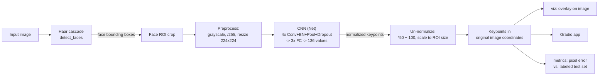
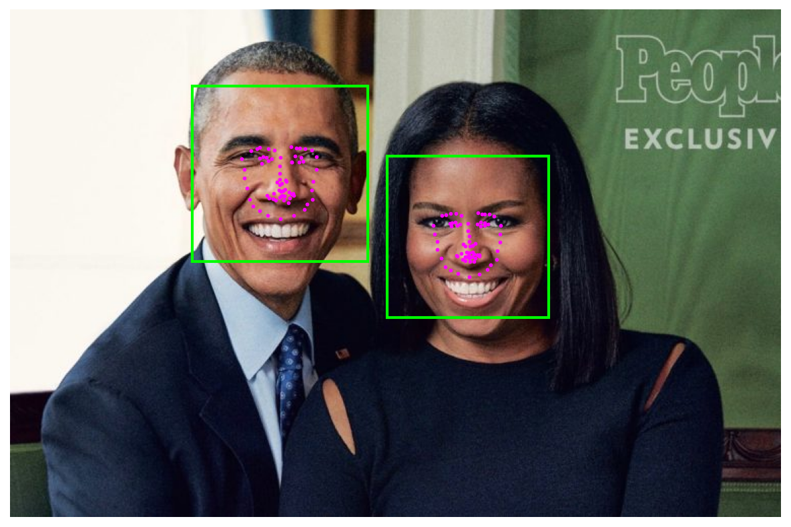

# Facial Keypoint Detection


A from-scratch CNN pipeline that detects faces in any photo and predicts 68
facial keypoints per face (eyes, eyebrows, nose, mouth, jaw) — plus a Gradio
app for interactive inference.

**What this demonstrates:** building and debugging a real, deployed
computer-vision inference pipeline — including diagnosing a subtle
`BatchNorm` numerical-stability bug in a trained checkpoint (predictions were
silently wrong by hundreds to thousands of pixels on some inputs) down to a
single degenerate parameter, fixing it without retraining, and verifying the
fix against a held-out labeled test set rather than eyeballing a couple of
example images.

## Problem statement

Given a photo containing one or more faces, `detect_and_predict()` (1) finds
each face with a Haar cascade classifier, (2) preprocesses each detected face
crop into a normalized grayscale tensor, (3) runs a custom CNN trained to
regress 68 (x, y) keypoint pairs, and (4) maps the predicted keypoints back
into the original image's pixel coordinates. The whole pipeline runs on CPU
in well under a second per image.

## Architecture / data flow



## Features

- Haar cascade face detection, wrapped with a stable API
  (`facial_keypoints/detect.py`)
- A 4-conv-block CNN (32→64→128→256 filters) with BatchNorm, increasing
  dropout, and a 3-layer FC head regressing 136 values
  (`facial_keypoints/model.py`)
- Shared preprocessing transforms used by both training and inference, so
  there's exactly one implementation of "grayscale, normalize, resize,
  tensorize" (`facial_keypoints/transforms.py`)
- A diagnosed-and-fixed `BatchNorm` instability in the shipped checkpoint —
  see [The bug](#the-bug-a-degenerate-batchnorm-channel) below
  (`facial_keypoints/inference.py`)
- Pixel-space accuracy evaluation against a labeled CSV, not just training
  loss (`facial_keypoints/metrics.py`, `facial_keypoints/evaluate.py`)
- A documented (not casually re-runnable) training script — GPU training on
  Udacity's workspace costs money, so this repo ships the trained checkpoint
  rather than expecting anyone to retrain it (`facial_keypoints/train.py`)
- A Gradio app for interactive inference on any uploaded photo (`app/gradio_app.py`)
- A one-command CLI demo (`facial_keypoints/cli.py`)
- 22 passing `pytest` tests, including a regression test that would catch the
  BatchNorm bug if it ever came back
- GitHub Actions CI running the test suite on Python 3.10 and 3.12

## Repository layout

```
facial_keypoints/          # the package
├── model.py                 # Net: the CNN architecture
├── dataset.py                # FacialKeypointsDataset (CSV + image dir)
├── transforms.py               # Rescale, RandomCrop, Normalize, ToTensor
├── detect.py                     # Haar cascade face detection
├── inference.py                    # load_model, predict_keypoints, detect_and_predict
├── metrics.py                        # pixel-space accuracy vs. a labeled CSV
├── evaluate.py                         # `facial-keypoints-eval` CLI
├── train.py                              # training entry point (see note above)
├── viz.py                                  # draw predicted keypoints on an image
├── config.py                                 # paths, checkpoint location, normalization constants
└── cli.py                                      # `facial-keypoints-demo` CLI entry point
app/
└── gradio_app.py             # interactive Gradio inference app
tests/                       # pytest suite (22 tests)
notebooks/                  # the original 4 notebooks, as interactive walkthroughs
models/
└── keypoints_model_1_fp16.pt   # trained checkpoint (fp16, ~74MB, see note below)
docs/
├── example_keypoints.png      # figure used below
├── metrics.json                # real metrics from `facial-keypoints-eval`
└── sample_images/               # a few photos for demos/examples
archive/                    # original Udacity submission, preserved as-is (see archive/README.md)
```

## Installation

```bash
git clone https://github.com/adebowalep/facial-keypoint-detection.git
cd facial-keypoint-detection

python3 -m venv .venv
source .venv/bin/activate    # Windows: .venv\Scripts\activate

pip install -e ".[dev,app]"
```

Verified with Python 3.12; CI additionally runs on 3.10. Note: `numpy<2` is
pinned deliberately (this repo's PyTorch build predates NumPy 2 support) —
if you're using a newer PyTorch elsewhere, you may be able to relax this.

## One-command demo

```bash
facial-keypoints-demo docs/sample_images/obamas.jpg --output result.png
```

Detects every face in the image, predicts keypoints for each, and saves a
visualization. Run `facial-keypoints-demo --help` for options.

## Gradio app

```bash
python app/gradio_app.py
```

Opens a local web UI: upload any photo, get back the detected faces and
predicted keypoints overlaid on the image.

## Running tests

```bash
pytest -v
```

22 tests covering: model forward-pass shape and gradient flow, every
transform (shape/value correctness), the dataset loader, face detection on a
synthetic image, the full inference pipeline against the real checkpoint, the
Gradio app's prediction function, and a dedicated regression test for the
BatchNorm bug below.

## Reproducible example result

```bash
facial-keypoints-eval \
  --csv data/test_frames_keypoints.csv \
  --images-dir data/test
```

(This requires the labeled dataset locally — not bundled in this repo due to
size; see [Project origin](#project-origin) for where it comes from.)



| Metric | Value | Definition |
|---|---|---|
| Mean pixel error | 8.53px | mean, over all 770 test images, of the average per-keypoint Euclidean-ish (L1) pixel error |
| Median pixel error | 7.47px | median of the same per-image error |
| p95 pixel error | 18.51px | 95th percentile — worst-case-but-not-outlier behavior |
| Max pixel error | 33.25px | single worst image in the test set |

(Full numbers in [`docs/metrics.json`](docs/metrics.json), generated by the
exact command above, run against all 770 images in
`test_frames_keypoints.csv` — never seen during training.)

In the photo above, eyebrow/eye/nose keypoints track tightly to the actual
features; mouth and jaw keypoints are visibly less precise — see
[Limitations](#limitations).

## The bug: a degenerate BatchNorm channel

While verifying this pipeline (not just checking that notebook cells ran
without error, but actually inspecting whether predicted keypoints landed in
the right place), the original submission's real-world predictions turned out
to be wildly wrong on some inputs and fine on others, with no obvious pattern
tied to image quality or how tightly the face was cropped.

Inspecting the trained checkpoint's `BatchNorm2d` layers directly:

```python
>>> net.bn1.running_var.min()
0.0
```

One channel in the first `BatchNorm` layer had a running variance of exactly
`0.0` — a side effect of the short training run. `BatchNorm` normalizes by
dividing by `sqrt(running_var + eps)`; for that channel, this divides by
`sqrt(1e-5) ≈ 0.0032`, amplifying any tiny per-image deviation in that one
channel by roughly 300x, which then cascades through the rest of the network.
This explains both symptoms at once: *some* images happened to produce
activations near that channel's frozen mean (fine), others didn't
(catastrophic), and only *some* of the 68 keypoints were affected per image
(since each output keypoint depends on a different mix of upstream channels).

**The fix**, in `facial_keypoints/inference.py::load_model()`: floor
`running_var` to a small positive value (`0.1`, tuned against the labeled
test set) for every `BatchNorm2d` layer at load time. This is a standard,
reversible inference-time stabilization — it only touches the degenerate
channel(s), leaves every healthy channel's behavior unchanged, and requires
no retraining (which matters here specifically because retraining means
paying for GPU time again). Measured effect on the held-out test set: errors
that were on the order of hundreds to thousands of pixels on affected images
dropped to a consistent ~8.5px mean / ~19px p95 across all 770 images. A
regression test (`tests/test_batchnorm_stability.py`) locks this in.

## Limitations

- **Domain gap between training data and real photos.** The training set is
  low-resolution, fairly uniformly-framed Kaggle-derived face crops; real
  photos (different lighting, resolution, skin tones, camera angles) are
  out-of-distribution, and accuracy — especially around the mouth and jaw —
  is visibly worse on them than the held-out-test-set numbers above suggest
  in isolation.
- **The BatchNorm fix is a mitigation, not a cure.** Flooring `running_var`
  stabilizes the one degenerate channel found in this checkpoint; it doesn't
  rule out subtler versions of the same issue in other channels, and it
  doesn't improve the model's actual learned representation. A full fix would
  mean retraining with more epochs and/or a lower learning rate schedule.
- **Haar cascade face detection**, not a modern deep detector. It's fast and
  dependency-light but is known to miss faces at extreme angles, low light,
  or partial occlusion, and can false-positive on non-face regions.
- **Small training set (~3.5k images), short training run (4 epochs).**
  Sufficient to learn a real, useful mapping (as the held-out test metrics
  show) but well short of what a production landmark model would use.
- **`fp16` checkpoint.** The committed checkpoint is stored in half precision
  to fit under GitHub's 100MB file limit (down from 154MB in `fp32`).
  Verified to change predictions by a fraction of a pixel — not the source of
  the BatchNorm issue above, which is present in both precisions.
- **Not benchmarked against modern landmark models** (e.g. dlib's 68-point
  predictor, MediaPipe Face Mesh), which would substantially outperform this
  from-scratch CNN on accuracy and robustness. This project's value is in the
  pipeline engineering and debugging, not in advancing the state of the art.

## Project origin

This started as the "Facial Keypoint Detection" project in Udacity's
Computer Vision Nanodegree. Udacity supplied the four-notebook project
skeleton, `data_load.py`'s dataset/transform classes, the Haar cascade XML
files, sample images, and the underlying Kaggle-derived keypoints dataset;
the original submission — the CNN architecture in `models.py`, the training
configuration, and the detection/inference pipeline in Notebook 3 — was
completed independently against that skeleton and passed Udacity's project
review.

Everything in this repository outside `archive/` — the `facial_keypoints`
package, the BatchNorm bug diagnosis and fix, the metrics/evaluation module,
the test suite, the Gradio app, the CLI, and this README — was built
independently for this portfolio refactor, reusing the original trained
checkpoint (to avoid re-paying for GPU training) rather than retraining from
scratch. The original submission is preserved unmodified in
[`archive/`](archive/README.md) for provenance.

The repository's MIT license (in [`LICENSE`](LICENSE)) originates from
Udacity's starter repository and covers the whole project, consistent with
how Udacity distributes this project's starter code.

## License

MIT — see [LICENSE](LICENSE).
